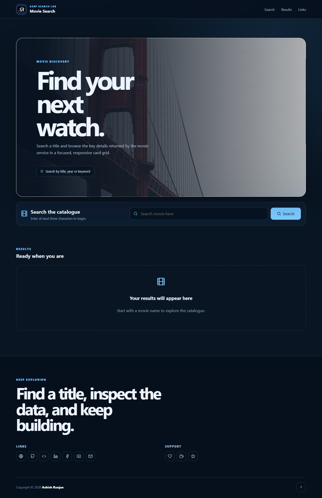

# Movie Search App

A responsive React movie search interface that sends a title to a configurable search API and presents the returned results in a clear card grid.

## Features

- Fixed branded header with mobile navigation
- Configurable API search through `REACT_APP_MOVIE_SEARCH_URL`
- Loading, validation, empty and service-error states
- Responsive movie cards with poster fallback and metadata
- Local visual assets, icon-only footer links and floating go-top control

## Tech stack

- React and Create React App
- SCSS modules
- Axios
- React Icons and React Toastify

## Run locally

```bash
npm install
npm start
```

Create a `.env` file with the search endpoint before searching:

```env
REACT_APP_MOVIE_SEARCH_URL=https://your-search-service.example/api/search
```

## Deploy

```bash
npm run deploy
```

## Screenshot



## Links

- Live: [https://a2rp.github.io/movie-search-app/](https://a2rp.github.io/movie-search-app/)
- Repository: [https://github.com/a2rp/movie-search-app](https://github.com/a2rp/movie-search-app)
- Portfolio: [https://www.ashishranjan.net/](https://www.ashishranjan.net/)
- GitHub: [https://github.com/a2rp](https://github.com/a2rp)
- CodePen: [https://codepen.io/ash1198](https://codepen.io/ash1198)
- LinkedIn: [https://www.linkedin.com/in/aashishranjan](https://www.linkedin.com/in/aashishranjan)
- Facebook: [https://www.facebook.com/theash.ashish/](https://www.facebook.com/theash.ashish/)
- YouTube: [https://www.youtube.com/@ashishranjan-ashz?sub_confirmation=1](https://www.youtube.com/@ashishranjan-ashz?sub_confirmation=1)
- Email: [ash.ranjan09@gmail.com](mailto:ash.ranjan09@gmail.com)

## Support

- Support: [https://a2rp-donation-page.netlify.app/](https://a2rp-donation-page.netlify.app/)
- Buy Me a Coffee: [https://buymeacoffee.com/a2rp](https://buymeacoffee.com/a2rp)
- Patreon: [https://patreon.com/a2rp](https://patreon.com/a2rp)